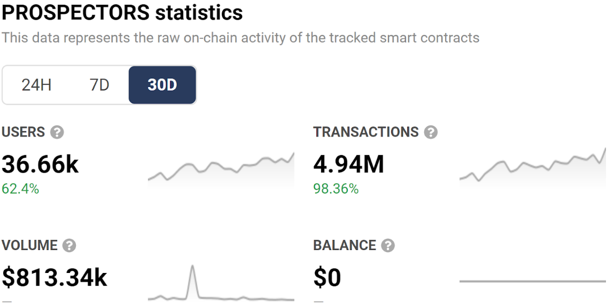
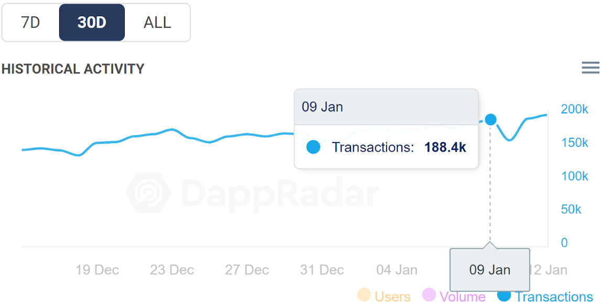
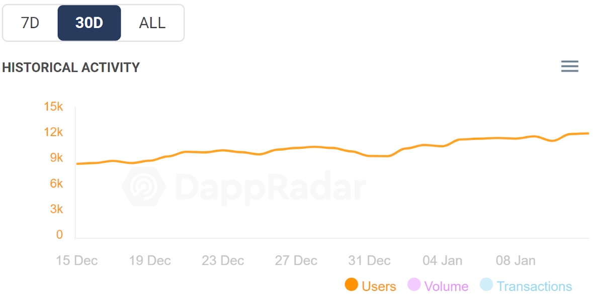
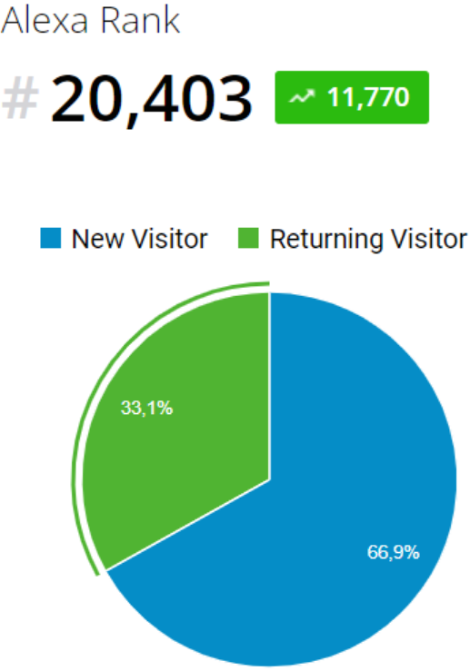
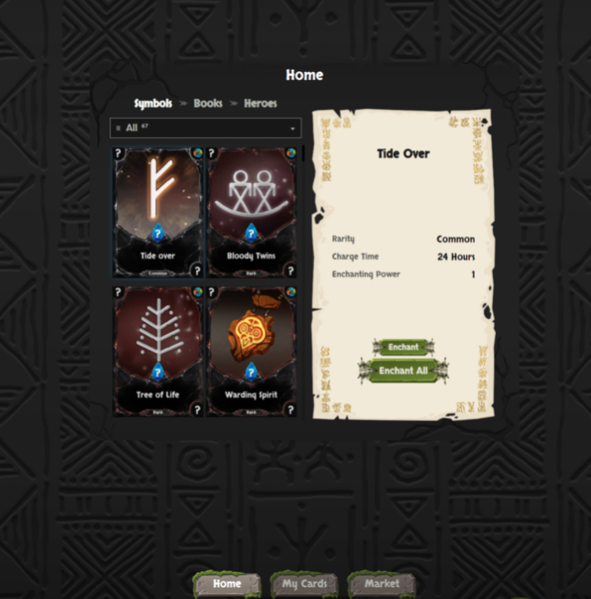

## What is the name of your Guild?

* name: WeCan
* bp_name_MAINNET: bp.wecan
* bp_name_TESTNET: wecan
* website: https://wecan.dev/
* keybase: https://keybase.pub/wecan_dev/

## Does your Guild have any new information to submit that impacts Technical Operations?

Block producer nodes, full api and seed nodes have been setup for MAINNET and TESTNET.
We're successfully keeping TESTNET block producer CPU latency under 0.25 ms.
MAINNET BP is running on the same hardware so we expect it to perform the same.
Block availability is 100% over the last couple of months.
Almost all crucial validations have been passed:
* https://validate.eosnation.io/wax/producers/bp.wecan.html
* https://validate.eosnation.io/waxtest/producers/wecan.html

What has been done:
1. Successfully upgraded all exposed and internal nodeos components to 2.0.13 version.
2. Released for the public use Hyperion and History API with streaming enabled.
3. Started publishing delphioracle feed data on TESTNET and MAINNET.
4. Deployed additional set of MAINNET seed p2p nodes in third region (we already have two seed nodes in one US region and one in GB) to be able to cover more clients globally with suitable latencies.
Increased the number of p2p clients to 200 per each seed endpoint.
5. Tested for stability all the existing infrastructure that was provided by us in the previous month.

What we're working on right now:
1. Hyperion upgrade to 3.3.5 version.
2. Creation of public testnet Hyperion API service.
3. Increasing self recovery capabilities for APIs and block producers.
4. Research on lightweight Hyperion-like solution with sliding history window for practical use and easier maintenance.
5. Research on AtomicAssets API deployment and support.
6. Proceed validation of API rate limits which are limited only by available resources at the moment.
7. Development of proactive observability framework for WAX infrastructure.

## Does your Guild have any new information to submit that impacts Product Development?

All our projects are deeper and more sophisticated than may seem at first sight. That's why we'll try to tell at least a part of what has been done so far and what is in development right now.

### Prospectors
* Status: **release**
* Daily active users (DAU): **12k**
* Monthly active users (MAU): **36k**
* Monthly trade volume (if your product has NFTs): **$299K**
* Website: https://prospectors.io
* Twitter: https://twitter.com/prospectorsgame **9257 Followers**
* Telegram Community: https://t.me/prospectorsgame **5.8K Followers**
* Medium page : https://prospectors.medium.com **2.1K Followers**
* Reddit: https://www.reddit.com/r/Prospectorsio/ **620 Members**

The latest developments are related to these topics which are described below:
* game
* wiki
* bank
* railway
* token migrator

**Game**

Several actions are available for a player in the game, such as mining resources, processing materials, making tools, construction of buildings, industrial production, industrial mining, a market of in-game assets, a market of work, land auction, and much more. The player fulfills every game action by himself. They may also hire other players if they need help or want to expedite the process.
We've added support of the Atomic Asset NFT standard in the newest Prospectors world, launched on WAX.

Reference links for the stats above
* https://dappradar.com/rankings/protocol/wax/category/games
* https://dappradar.com/wax/games/prospectors

**WIKI**

Prospectors WIKI is a base of knowledge, where the player can find all the info they need and understand the whole structure of the project.
* https://grandland.prospectors.io/wiki.html?locale=en

**Bank**

The Bank is a system of players’ rewards for staking the in-game token, PGL. Rewards are formed from funds gathered from the taxation of every in-game financial operation. There is a 5% tax fee in the game.

* https://wax-bank.prospectors.io/

**Railway**

The railway allows players to transport in-game assets to other game worlds and vice versa, including game worlds developed on different blockchains (EOS & WAX).

**Token Migration**

The migrator allows sending game tokens between EOS and WAX blockchains with ease.

**Alexa Rank**

### R-Planet
* Status: **release/ in development**
* Daily active users (DAU): **2.5k**
* Monthly active users (MAU): **16k**
* Monthly trade volume (if your product has NFTs): **$119K**
* Website: https://rplanet.io
* Twitter: https://twitter.com/RPLANETio **23.1K Followers**
* Telegram: https://t.me/rplanetio **8.5K Followers**
* Medium page: https://rplanet.medium.com **4.6K Followers**

The latest developments are related to these topics which are described below:
* Staking System
* Game (Generator)
* Lands
* R-DAO
* Marketplace
* Unpacking
* Drops
* Game (Conquest)

**Staking System**

Conditionally the staking system could be divided into two parts. The first one is where players can stake NFTs of third-party projects on the WAX blockchain to mine Aether, the game token of the project. The second part is where players use NFTs native to the R-Planet project for the same purpose, staking to mine Aether.

During the first few weeks of 2022, the structure of the staking system for third-party projects will be changed.  All third party projects will be delisted from the staking mechanism and stop mining Aether. Then the community will get a chance to impact the choice of the projects that are to be included in the mining the game token Aether (21 projects in total).  Every owner of the game token will be able to use their tokens to vote for the third-party project they would like to see on the list of 21 .

At the present moment, the R-Planet smart contract requires 3.68 GB of RAM to hold 4 760 000 NFT’s

**Game  (Generator)**

The generator has been the first phase of the game, where players buy 4 initial element FT’s with the game's native token Aether and try to generate new elements by combining them together in unique proportions. If they are successful with their alchemy they will be deemed “Inventor” of the new element and receive a FT and a NFT. They can then get creative and use these new elements to try and create even more unique and exciting FT’s. By blending FT’s in the generator, players also have a chance to get native R-Planet NFTs which mine our game tokens much more effectively.

**Lands**

Lands are unique NFTs, which will provide an advantage for their owners during the next phase of the game, Conquest. For now, there is an option to mine tokens of game resources using lands. The lands start mining the minute their pack is opened based on their rarity. To improve the mining efficiency of the lands, players can inject the element FT’s they created in the generator to any land NFT, increasing its hourly mining rate of one of the four resources needed in the next phase. Mining of the resource tokens will stop with the launch of the game. At this time, those game tokens can be used for crafting unique combatant units, which will provide a nice advantage for players at the start of the Conquest Game.

**R-DAO**

R-DAO is a DAO system of R-Planet, the mission of which is to provide DAO token owners an opportunity to make decisions regarding the project's future and profit distribution.
The token distribution will happen in a few stages, such as the airdrop for active players, purchasable in auction for game tokens, mining through adding liquidity on the decentralized swaps, and mining through trading on a marketplace. The sale of the token and mining through adding liquidity are going to start in February.

**Marketplace**

The marketplace is currently under active development. The important part of the development of the UI and smart contract are ready. Work is underway to create a backend for quick access to collection data. This part of the project is scheduled to launch in 2022.
https://rplanet.medium.com/psssst-want-to-know-all-about-super-secret-51a7d262f5bc

**R-Planet Unpacking**

We have created a preminted unpacking feature. It is free for WAX users. The next step will be to develop a UI to make this feature convenient for the average user.
Unpacking smart contract: pmu.rplanet
Unpacking site: https://rplanet.io/pmunpacking?ids=0

**R-Planet Drops**

The drops system is also ready and open to WAX users. A UI still remains to be developed.
Unpacking smart contract: d.rplanet
Unpacking site: https://rplanet.io/robocraft

**Game (Conquest)**

R-Planet Conquest is a full-fledged MMORTS game, supported by and using NFT assets (Atomic Asset). Players will build bases, unite with neighbors in alliances, fight with game characters or other players, complete quests, and much more. It will be divided into timed game servers. They will each have a start and end date. The winners of the game server will be awarded rare game assets.
We plan to launch open beta testing in April-May 2022. Closed alpha is scheduled for March-April 2022. Closed alpha will only be available for active users and bloggers.

***This part of game is in active development and results have been shared over the private channels to Inspector Generals.***

### Tribal Books
* Status: **in development**
* Monthly trade volume (if your product has NFTs) - **$18.5K**
* Website: https://tribalbooks.io
* Twitter: https://twitter.com/TribalBooks **4186 Followers**
* Telegram: https://t.me/tribalbooks **1.6K Followers**
* Medium page: https://tribalbooks.medium.com **355 Followers**

The latest developments are related to these topics which are described below:
* Game
* Hero

**Game**

Tribal Books is a card game where events and adventure take place on a grand map. The main goal is clear, be the first player to finish successfully. Other players will be competing with you in this direction. They can create many unique and different obstacles in the way of their opponents. The player, using their Hero NFT, will be able to move around the map, overcome obstacles, and hinder their rivals in their quest to finish first.  
The game is under development and will be released by the end of 2022.
https://tribalbooks.io/tribalbooks-the_first_books.pdf

**Hero**

The ritual "Call the Hero" is an opportunity to get a game hero NFT (a rare game asset) for free. You have to use the existing NFTs of the project (symbols and books) to stake and then enchant once a day. By doing this you earn MANA, Tribal Books native token. Once you have collected enough MANA tokens (6000) from enchanting you can then “Call the Hero''. After doing so, the player receives a package containing a hero NFT from one of the five tribes, in one of six rarities. The hero is an exciting new game character that will be needed for the upcoming game.

This feature was launched at the end of 2021.
https://tribalbooks.medium.com/mana-enchanting-and-its-magic-numbers-c4e9d4e2b76

## Does your Guild have any new information to submit that impacts Ecosystem Development?

**WAX Block Explorer**

Website: https://waxscan.wecan.dev/

WeCan has begun developing an Explorer Unit. The purpose of the product is the planning to work out new features that have not yet been developed in other Explorers.
This project is under development. It is already possible to sort transactions by date, by name, and validity of the contract, by sending from or to a specific account.

**Public IPFS endpoint**

Website: https://ipfs.wecan.dev/ipfs/

We decided to expose public (yet another) highly available IPFS endpoint for the ecosystem users.

## Does your Guild have any new information to submit that impacts Community Engagement?

No

## Do you have any feedback for improving the Office of Inspector General, the Inspector General Guidelines, or this form?

No
